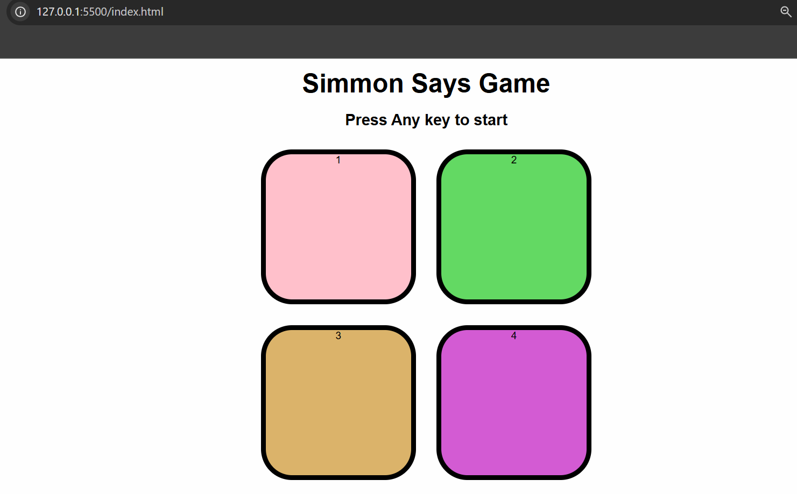

# 🧠 Simon Says Game

A classic memory game built using **HTML**, **CSS**, and **JavaScript**. This is a fun and interactive browser game where players must repeat an increasingly long sequence of button flashes.

---

## 📷 Screenshot

 *(Optional: Add a screenshot image)*

---

## 🛠️ Features

- 🎨 Colorful and responsive UI
- 🧠 Memory-based game logic
- 💡 Game levels that increase in difficulty
- ❌ Game over animation
- 🖱️ Works with mouse and keyboard
- 📱 Fully responsive for mobile and tablet

---

## 🚀 How to Play

1. Press any key to start the game.
2. Watch the color sequence shown by the game.
3. Repeat the sequence by clicking the buttons.
4. The sequence grows by 1 color every round.
5. If you click the wrong button — game over!

---

## 🧾 Technologies Used

- HTML5
- CSS3 (Flexbox & Media Queries)
- Vanilla JavaScript (no libraries)

---

## 🧩 Folder Structure

